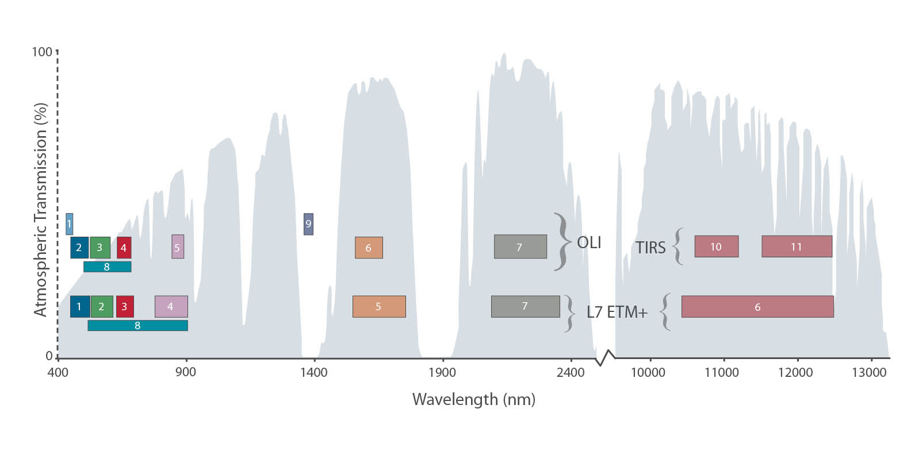

```{r setup, include=FALSE}
options(htmltools.dir.version = FALSE)
knitr::opts_chunk$set(
  fig.width=9, fig.height=3.5, fig.retina=3,
  out.width = "100%",
  cache = FALSE,
  echo = TRUE,
  message = FALSE, 
  warning = FALSE,
  hiline = TRUE
)
```

```{r xaringan-themer, include=FALSE, warning=FALSE}
library(xaringanthemer)
style_duo_accent(
  primary_color = "#E1B419",
  secondary_color = "#eb9b34",
  inverse_header_color = "#FFFFFF",
  header_font_google = google_font("Josefin Sans"),
  text_font_google   = google_font("Montserrat", "300", "300i"),
  code_font_google   = google_font("Fira Mono")
)
```
class: center

## Instruction

#### *   **summary** criterion will refer to the summary of the sensor you have selected.
#### *   **application** criterion will refer to examples of studies that have used the data from the sensor and their purpose
#### *   **reflection** criterion will refer to what you have learnt in relation to the sensor, its use and how the data might be used in future work.
---
## Overview: Landsat 8/9
#### Launched in 2013, Landsat 8 marked the beginning of modern satellite imagery.
#### Utilized new push-broom sensor (OLI) that created instantaneous scan lines with a line of detectors (7,000!), instead of just a few detectors reflected with mirrors with the whisk broom sensor. This caused problems resulting in a zig-zaged image in Lansat 7.
#### Combined with 2021's Landsat 9 in the same orbit, Earth data is available every **8 days**!

**Spatial Resolution** : moderate to high resolution (15m - 100m)

**Temporal Frequency** : ~725 scenes day, huge increase from Landsat 7!! Landsat 9: 1,400/per day.

**Spectral Resolution** : visible, near infrared, short waved infrared, thermal infrared.

.pull-left[
```{r echo=FALSE, out.width='40%', fig.align='right'}
knitr::include_graphics("img/whisk_broom.jpeg")
```
]
.pull-right[
```{r echo=FALSE, out.width='35%', fig.align='left'}
knitr::include_graphics("img/push_broom.jpeg")
```
]
---
## Scientific Instruments
.pull-left[
### **Operational Land Imager OLI**
* Responsible for the new push broom tech!
* Measures in visible, near infrared, and short wave infrafred of the spectrum.
* Spatial resolution includes 15m panchromatic and 30m multi-spectral with a 185km wide swath.
* OLI collects 
]
.pull-right[
### **Thermal InfraRed Sensor TIRS**
* Measures invisiblethermal infrared by detecting 2 thermal infrared wavelength bands (1 for Earth's surface, 1 for the atmosphere) 
* Proven useful for tracking land and water consumption from previous missions. 
]
```{r echo=FALSE, out.width='55%', fig.align='center'}

```
---
class: inverse
## Another thing (Summary)

```{r echo=FALSE, out.width='60%', fig.align='center'}
knitr::include_graphics("img/BandpassesL7vL8_Jul20131-1024x611-1.jpeg")
```
---
## c/s 1 (Application)

Examples of studies that have used this data from this sensor and their purpose

---
## c/s 2 (Application)

---

## reflection (Reflection)

---

## reflection 2 (Relfection)
dfv

--- 


.left-column[
Text color

[Link Color](#3)

**Bold Color**

_Italic Color_

`Inline Code`
]

.right-column[
Lorem ipsum dolor sit amet, [consectetur adipiscing elit (link)](#3), 
sed do eiusmod tempor incididunt ut labore et dolore magna aliqua. 
Erat nam at lectus urna.
Pellentesque elit ullamcorper **dignissim cras tincidunt (bold)** lobortis feugiat. 
_Eros donec ac odio tempor_ orci dapibus ultrices. 
Id porta nibh venenatis cras sed felis eget velit aliquet.
Aliquam id diam maecenas ultricies mi.
Enim sit amet 
`code_color("inline")`
venenatis urna cursus eget nunc scelerisque viverra.
]


Text can be **bold**, _italic_, ~~strikethrough~~, or `inline code`.

[Link to another slide](#colors).


# Big Topic or Inverse Slides `#`

## Slide Headings `##`

### Sub-slide Headings `###`

#### Bold Call-Out `####`

This is a normal paragraph text. Only use header levels 1-4.

##### Possible, but not recommended `#####`

###### Definitely don't use h6 `######`

---

# Left-Column Headings

.left-column[
## First

## Second

## Third
]

.right-column[
Dolor quis aptent mus a dictum ultricies egestas.

Amet egestas neque tempor fermentum proin massa!

Dolor elementum fermentum pharetra lectus arcu pulvinar.
]

---
class: inverse center middle

# Topic Changing Interstitial

--

```
class: inverse center middle
```

---
layout: true

## Blocks

---

### Blockquote

> This is a blockquote following a header.
>
> When something is important enough, you do it even if the odds are not in your favor.

---

### Code Blocks

#### R Code

```{r eval=FALSE}
ggplot(gapminder) +
  aes(x = gdpPercap, y = lifeExp, size = pop, color = country) +
  geom_point() +
  facet_wrap(~year)
```

#### JavaScript

```js
var fun = function lang(l) {
  dateformat.i18n = require('./lang/' + l)
  return true;
}
```

---

### More R Code

```{r eval=FALSE}
dplyr::starwars %>% dplyr::slice_sample(n = 4)
```

---

```{r message=TRUE, eval=requireNamespace("cli", quietly = TRUE)}
cli::cli_alert_success("It worked!")
```

--

```{r message=TRUE}
message("Just a friendly message")
```

--

```{r warning=TRUE}
warning("This could be bad...")
```

--

```{r error=TRUE}
stop("I hope you're sitting down for this")
```


---
layout: true

## Tables

---
exclude: `r if (requireNamespace("tibble", quietly=TRUE)) "false" else "true"`

```{r eval=requireNamespace("tibble", quietly=TRUE)}
tibble::as_tibble(mtcars)
```

---

```{r}
knitr::kable(head(mtcars), format = 'html')
```

---
exclude: `r if (requireNamespace("DT", quietly=TRUE)) "false" else "true"`

```{r eval=requireNamespace("DT", quietly=TRUE)}
DT::datatable(head(mtcars), fillContainer = FALSE, options = list(pageLength = 4))
```

---
layout: true

## Lists

---

.pull-left[
#### Here is an unordered list:

*   Item foo
*   Item bar
*   Item baz
*   Item zip
]

.pull-right[

#### And an ordered list:

1.  Item one
1.  Item two
1.  Item three
1.  Item four
]

---

### And a nested list:

- level 1 item
  - level 2 item
  - level 2 item
    - level 3 item
    - level 3 item
- level 1 item
  - level 2 item
  - level 2 item
  - level 2 item
- level 1 item
  - level 2 item
  - level 2 item
- level 1 item

---

### Nesting an ol in ul in an ol

- level 1 item (ul)
  1. level 2 item (ol)
  1. level 2 item (ol)
    - level 3 item (ul)
    - level 3 item (ul)
- level 1 item (ul)
  1. level 2 item (ol)
  1. level 2 item (ol)
    - level 3 item (ul)
    - level 3 item (ul)
  1. level 4 item (ol)
  1. level 4 item (ol)
    - level 3 item (ul)
    - level 3 item (ul)
- level 1 item (ul)

---
layout: true

## Plots

---

```{r plot-example, eval=requireNamespace("ggplot2", quietly=TRUE)}
library(ggplot2)
(g <- ggplot(mpg) + aes(hwy, cty, color = class) + geom_point())
```

---

```{r plot-example-themed, eval=requireNamespace("showtext", quietly=TRUE) && requireNamespace("ggplot2", quietly=TRUE)}
g + xaringanthemer::theme_xaringan(text_font_size = 16, title_font_size = 18) +
  ggtitle("A Plot About Cars")
```

.footnote[Requires `{showtext}`]


---
class: center, middle

# Thanks!

Slides created via the R packages:

[**xaringan**](https://github.com/yihui/xaringan)<br>
[gadenbuie/xaringanthemer](https://github.com/gadenbuie/xaringanthemer)

The chakra comes from [remark.js](https://remarkjs.com), [**knitr**](http://yihui.name/knitr), and [R Markdown](https://rmarkdown.rstudio.com).
