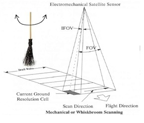

```{r setup, include=FALSE}
options(htmltools.dir.version = FALSE)
knitr::opts_chunk$set(
  fig.width=9, fig.height=3.5, fig.retina=3,
  out.width = "100%",
  cache = FALSE,
  echo = TRUE,
  message = FALSE, 
  warning = FALSE,
  hiline = TRUE
)
```

```{r xaringan-themer, include=FALSE, warning=FALSE}
library(xaringanthemer)
style_duo_accent(primary_color = "#2C5F2D", secondary_color = "#97BC62FF",
  header_font_google = google_font("Josefin Sans"),
  text_font_google   = google_font("Montserrat", "300", "300i"),
  code_font_google   = google_font("Fira Mono")
)
```

class: center, title-slide, middle

background-image: url("img/nasa.jpg")
background-size: cover
background-position: center


# Week 2 Learning Diary
## Introducing Landsat 8
### Summary, Application, Reflection

### `r format(Sys.time(), "%d/%m/%Y")`


<a href="https://github.com/asdfgukyu/rm-site" class="github-corner" aria-label="View source on GitHub"><svg width="80" height="80" viewBox="0 0 250 250" style="fill:#fff; color:#151513; position: absolute; top: 0; border: 0; left: 0; transform: scale(-1, 1);" aria-hidden="true"><path d="M0,0 L115,115 L130,115 L142,142 L250,250 L250,0 Z"></path><path d="M128.3,109.0 C113.8,99.7 119.0,89.6 119.0,89.6 C122.0,82.7 120.5,78.6 120.5,78.6 C119.2,72.0 123.4,76.3 123.4,76.3 C127.3,80.9 125.5,87.3 125.5,87.3 C122.9,97.6 130.6,101.9 134.4,103.2" fill="currentColor" style="transform-origin: 130px 106px;" class="octo-arm"></path><path d="M115.0,115.0 C114.9,115.1 118.7,116.5 119.8,115.4 L133.7,101.6 C136.9,99.2 139.9,98.4 142.2,98.6 C133.8,88.0 127.5,74.4 143.8,58.0 C148.5,53.4 154.0,51.2 159.7,51.0 C160.3,49.4 163.2,43.6 171.4,40.1 C171.4,40.1 176.1,42.5 178.8,56.2 C183.1,58.6 187.2,61.8 190.9,65.4 C194.5,69.0 197.7,73.2 200.1,77.6 C213.8,80.2 216.3,84.9 216.3,84.9 C212.7,93.1 206.9,96.0 205.4,96.6 C205.1,102.4 203.0,107.8 198.3,112.5 C181.9,128.9 168.3,122.5 157.7,114.1 C157.9,116.9 156.7,120.9 152.7,124.9 L141.0,136.5 C139.8,137.7 141.6,141.9 141.8,141.8 Z" fill="currentColor" class="octo-body"></path></svg></a><style>.github-corner:hover .octo-arm{animation:octocat-wave 560ms ease-in-out}@keyframes octocat-wave{0%,100%{transform:rotate(0)}20%,60%{transform:rotate(-25deg)}40%,80%{transform:rotate(10deg)}}@media (max-width:500px){.github-corner:hover .octo-arm{animation:none}.github-corner .octo-arm{animation:octocat-wave 560ms ease-in-out}}</style>


---


## Overview: Landsat 8

#### Launched in 2013, Landsat 8 marked the beginning of modern satellite imagery.

Utilised new push-broom sensor (OLI) that created instantaneous scan lines with a line of detectors (7,000!), instead of just a few detectors reflected with mirrors with the whisk broom sensor. This caused problems resulting in a zig-zaged image in Lansat 7.

Combined with 2021's Landsat 9 in the same orbit, Earth data is available every **8 days**!

**Spatial Resolution** : moderate to high resolution (15m - 100m)

**Temporal Frequency** : ~725 scenes day, huge increase from Landsat 7 (350) (note: Landsat 9: 1,400/per day)

**Spectral Resolution** : 5 visible and near infrared (NVIR) bands, 3 short waved infrared (SWIR) bands, 1 panchromatic image (PAN), 2 thermal infrared (TIR) bands.

.pull-left[
```{r echo=FALSE, out.width='40%', fig.align='right'}

```
]
.pull-right[
```{r echo=FALSE, out.width='35%', fig.align='left'}
knitr::include_graphics("img/push_broom.jpeg")
```
]
---
## Scientific Instruments
.pull-left[
### **Operational Land Imager OLI**

- Responsible for the new push broom tech.
- Measures in visible, near infrared, and short wave infrared of the spectrum —
- Spatial resolution includes 15m panchromatic and 30m multi-spectral with a 185km wide swaths
]

.pull-right[

### **Thermal InfraRed Sensor TIRS**

- Measures invisible thermal infrared by detecting 2 thermal infrared wavelength bands (1 for Earth's surface, 1 for atmosphere at 100m. This was no available in Landsat 7.
- Proven useful for tracking land and water consumption from previous missions.
]

```{r echo=FALSE, out.width='40%', fig.align='center'}

```
---
class:, center, title-slide, middle

background-image: url("img/imaginearth-la-terre-en-images-opZ--yE1-hg-unsplash.jpg")
background-size: cover
background-position: center

# Application

---

class: inverse
## Application
### Land Surface Temperature

.pull-left[
### Urban Heat Island:
- Kaplan et al 2018 used Landsat 8 to collect LST data across varying land covers and vegetation abundance in Macedonia. 
- Normalised Difference Vegetation Index (NDVI) was used for vegetation extraction and Normalised Difference Built-up Index (NDBI) was used for urban extractions.
]   

.pull-right[
### Evapotranspiration:
- Using TIR data to measure the evaporation from soil surface evaporation of water intercepted by the canopy, and transpiration from vegetation
- Senay et al (2015) Used 528 Landsat 8 images to estimate evapotranspiration of the Colorado River Basin, assessing impact of surrounding 5 irrigation districts.
]

---
class: inverse

## Application

### Water monitoring
#### Satellite-derived Bathymetry:
- Using OLI Band 1 which is particularly good for imaging shallow water to measure water depths.
- Pacheco et al 2014 developed a linear algorithm to retrieve bathymetry from multispectral Landsat 8 imagery, using LiDAR data for tuning.
Wastewater
- In a similar vein, Trinh et al 2017 used Landsat 8 OLI and Aqua MODIS to extract areas of chlorophyll-a concentration as a result of improper wastewater management in Santa Monica, California.

### Foliage observation SWIR
Since vegetation tracking often replies on SWIR, this field has ben  robust since Landsat 7. However Landsat 8’s higher spatial temporal and narrower spectral resolution allows for more detailed obeservations
- Karlson et al 2015 Used Lansat 8 and random forest machine learning technique to mapp tree canopy cover and aboveground biomass in Sudano-Sahelian Woodlands.
    
---
class:, center, title-slide, middle

background-image: url("img/nasa-6-jTZysYY_U-unsplash.jpg")
background-size: cover
background-position: center
# Reflection
---
## reflection (Reflection)

---
## reflection 2 (Relfection)


